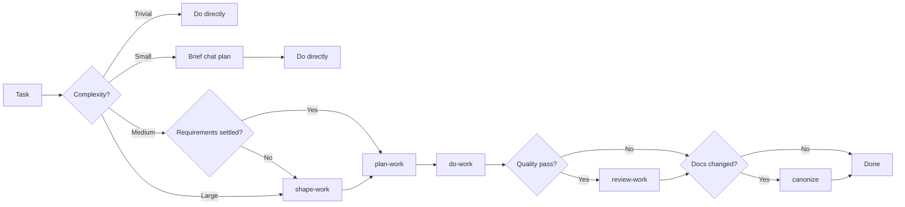

# Skills

Personal skills for agent-led software development.

An opinionated workflow package for coding agents where the agent does more of the mechanical work, and you keep the judgment calls: what problem is being solved, what complexity is worth introducing, what should be verified, and which project truths should become durable context.

## Quick start

1. Install the package (see [Install](#install)).
2. Prefer **explicit** skill calls (`$start-work`, `$do-work`, etc.).
3. Unsure how to approach something? Start with `$start-work`.
4. Clear small task? Just do it — no skill required.
5. Fuzzy product/engineering idea? `$shape-work` → `$plan-work` → `$do-work`.
6. Something broken? `$debug-work`, not the full plan pipeline.

### Do / don't

| Do | Don't |
| --- | --- |
| Call one skill at a time when you need structure | Turn every task into shape → plan → do |
| Use `$start-work` as the router when the path is unclear | Assume the agent will auto-pick the right process |
| Keep plans in chat for small/medium work | Default to heavy plan files |
| Use this suite's `$plan-work` / `$do-work` | Mix this with the agent's generic Plan mode and double-process the work |
| Use `$debug-work` when something is broken | Force broken behavior through the full product workflow |

### If you only install three

| Skill | Why |
| --- | --- |
| `$start-work` | Routes you to the smallest useful workflow |
| `$do-work` | Implementation defaults: readable code, low ceremony, pragmatic verification |
| `$debug-work` | Diagnosis loop for broken, flaky, or surprising behavior |

Add the rest when you hit fuzzy product work (`$shape-work`, `$plan-work`) or documentation mess (`$canonize`).

### One example

```txt
$start-work — "add team invites without overbuilding the org model"
  → $shape-work   (settle language and boundaries)
  → $plan-work    (streams, blockers, verification)
  → $do-work
  → $review-work  (optional quality pass)
  → $canonize     (if durable docs changed)
```

## What is a skill? (TLDR)

Skills are reusable playbooks the agent loads on demand. You invoke them by name (for example `$start-work`). This package is **explicit-invocation by default**: the agent should not silently run the whole workflow unless you ask.

You do not need a deep model of skills to use this package. Install them, call the ones you need, and let `$start-work` choose when you are unsure.

## Install

This is a multi-skill package intended for use with [skills](https://skills.sh).

From GitHub:

```bash
npx skills add morochena/skills
```

That opens an interactive prompt where you can choose which skills to install.

Optional commands:

```bash
npx skills add morochena/skills --list
npx skills add morochena/skills -g --skill '*'
npx skills add morochena/skills -g --skill start-work
```

From a local checkout while developing:

```bash
npx skills add /path/to/skills
```

Omit `-g` to install into the current project only. Use `-a <agent>` to target a specific agent ecosystem.

## Skills

| Skill | Use |
| --- | --- |
| `start-work` | Choose the right workflow for a task. |
| `brainblast` | Explore ideas from multiple angles before shaping or planning. |
| `shape-work` | Clarify fuzzy work and settle durable domain language. |
| `plan-work` | Create a parallelizable implementation plan for one coordinating agent. |
| `do-work` | Execute a plan, using worker agents in the current workspace where useful. |
| `review-work` | Review implementation quality, clarity, scope, tests, and polish. |
| `debug-work` | Diagnose broken, flaky, slow, or surprising behavior. |
| `improve-architecture` | Document architectural intent and audit the codebase for inconsistencies. |
| `canonize` | Normalize `docs/canon/` and remove planning sediment. |
| `canonize-mark` | Normalize canon while preserving and marking non-canonical docs. |

## Default flow

Start with the smallest useful workflow.

```txt
start-work
  -> direct action for trivial/small clear tasks
  -> shape-work for fuzzy medium/large work
  -> plan-work for coordinated or parallelizable work
  -> do-work for implementation
  -> review-work for post-build quality review
  -> canonize for documentation hygiene
```

`brainblast` and `debug-work` sit outside the main implementation workflow. Use `brainblast` before shaping when the idea is still exploratory. Use `debug-work` when the problem is broken behavior rather than planned product work.

`improve-architecture` is a focused structural audit. It establishes or reads `docs/architecture.md`, checks the codebase against that contract, and writes a remediation roadmap without refactoring production code by default.

## Routing

`start-work` routes by complexity and clarity, not by a fixed process checklist.



| Branch | Use when | Default next move |
| --- | --- | --- |
| Trivial | The task is obvious, local, and low-risk. | Do it directly. |
| Small | Requirements are clear, but a short assumption check helps. | Brief chat plan, then implement. |
| Medium | Several files, domain terms, or design choices are involved. | `shape-work` if fuzzy; otherwise `plan-work`. |
| Large | Multiple areas, blocking edges, or parallel streams are likely. | `shape-work`, then `plan-work`, then `do-work`. |

Adjacent modes:

| Mode | Use when | How it rejoins |
| --- | --- | --- |
| `brainblast` | The idea may be interesting, but is not requirements yet. | Hand off to `shape-work` or `plan-work` only if the idea becomes concrete. |
| `debug-work` | Something is broken, slow, flaky, or surprising. | Fix directly when obvious; otherwise hand off to `shape-work`, `plan-work`, or `do-work` depending on what the diagnosis reveals. |
| `improve-architecture` | The repository lacks a clear architecture contract or applies its patterns inconsistently. | Hand the agreed findings to `plan-work` or implement a selected finding with `do-work`. |

## Skill details

### `start-work`

Use this when the path is unclear. It classifies the task and recommends the smallest workflow that fits: direct action, shaping, planning, debugging, reviewing, or documentation cleanup.

`start-work` works best after the agent has at least a little context. You can invoke it at the beginning with a rough idea, or after chatting for a while when the conversation starts turning into real work.

Example:

```txt
User: I'm thinking about adding team invites. I want people to invite coworkers,
but I don't want to accidentally build a whole enterprise org model.

Agent: <asks a few clarifying questions or discusses tradeoffs>

User: Use $start-work to decide how we should approach this.

Agent: Recommendation: this is medium product/engineering work. Use $shape-work
first to settle the domain language and boundaries, then $plan-work once the
invite flow is clear. Keep the plan in chat unless it grows into a broader
account/team model change.
```

You can also start with it directly:

```txt
User: Use $start-work. I want to add team invites without overbuilding the
account model.
```

### `brainblast`

Use this when an idea is interesting but not ready to become requirements. It reads product context when available, explores the idea through several lenses, synthesizes promising directions, and asks which thread to pull next. It stays chat-first and does not write canon, create plans, or start implementation by default.

### `shape-work`

Use this when the idea is still fuzzy. The agent interviews one decision at a time, recommends answers, looks up codebase facts instead of asking for them, and updates `docs/canon/language.md` only when durable language has actually settled.

### `plan-work`

Use this when the work needs coordination. The plan identifies scope, non-goals, parallel streams, blocking edges, integration points, verification strategy, and a full-scope check so important work is not silently deferred.

Small and medium plans usually stay in chat. Large plans may be written to:

```txt
docs/plans/<slug>.md
```

Those files should use temporary frontmatter and later be absorbed or removed by `canonize`.

### `do-work`

Use this to execute a plan. The main agent session acts as coordinator and final integrator. Worker agents can handle independent streams in the current workspace when the platform supports them, but shared interfaces, architecture, and final verification stay with the coordinator.

Branches or worktrees are not the default. Use them when you explicitly want checkout isolation.

### `review-work`

Use this after implementation or when reviewing a diff. It focuses on correctness, scope fidelity, readability, complexity, naming, abstraction quality, pragmatic test coverage, performance, polish, and edge cases.

### `debug-work`

Use this for broken, flaky, slow, or surprising behavior. It is a diagnosis loop: state the claim, gather facts, reproduce or narrow the signal, localize the fault, test hypotheses, then fix or brief the fix.

### `improve-architecture`

Use this when the question is not whether one change is good, but whether the repository applies its own architectural decisions consistently. It creates or validates `docs/architecture.md`, audits representative end-to-end paths and cross-cutting patterns, then writes `docs/architecture-audit.md` with evidence, impact, target states, and safe migration order. It favors local constraints and reduced cognitive load over universal pattern prescriptions.

### `canonize` and `canonize-mark`

Use these to keep project documentation trustworthy. `canonize` absorbs durable truth into `docs/canon/` and removes stale planning sediment. `canonize-mark` keeps non-canonical docs in place but marks them so agents know they are not trusted canon.

## Rationale

Agent-led development works best when the agent has enough structure to move quickly, but not so much process that every task turns into ceremony.

These skills aim for a few defaults:

- **Explicit invocation.** Skills should be called when they are useful, not constantly inferred in the background.
- **Code as communication.** Implementation should be optimized for future readers, not just for getting a diff to pass.
- **Minimize complexity.** Prefer straightforward code, clear names, and local patterns. Avoid abstractions that add more cognitive load than they remove.
- **Pragmatic verification.** Tests and checks should buy confidence. They are tools, not rituals.
- **Canon over sediment.** Durable project truth belongs in `docs/canon/`. Temporary plans, ADR drafts, roadmaps, and generated notes should not quietly become permanent instructions.
- **Parallel where useful.** Medium and large work should be shaped into independent streams when possible, with one coordinating agent session delegating to worker agents when the platform supports it.

The intended value is a calmer workflow: clarify the work, preserve the important context, plan for parallel execution when it helps, implement with readable defaults, and clean up the documentation surface afterward.
