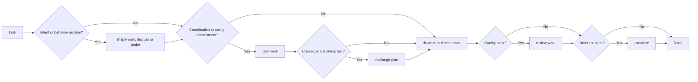

# Skills

Personal skills for agent-led software development.

An opinionated workflow package for coding agents where the agent does more of the mechanical work, and you keep the judgment calls: what problem is being solved, what complexity is worth introducing, what should be verified, and which project truths should become durable context.

The governing rule is simple: reduce the riskiest uncertainty with the cheapest high-signal artifact. Prefer a wireframe, script, test, trace, benchmark, contract, or working slice when it is cheap and reversible. Use prose for intent, constraints, ownership, dependencies, rollout, and rationale that executable artifacts cannot preserve.

## Quick start

1. Install the package (see [Install](#install)).
2. Prefer **explicit** skill calls (`$start-work`, `$do-work`, etc.).
3. Unsure how to approach something? Start with `$start-work`.
4. Clear small task? Just do it — no skill required.
5. Fuzzy product/engineering idea? Use `$shape-work`, then `$do-work` when intent settles.
6. Something broken? `$debug-work`, not the full plan pipeline.

### Do / don't

| Do | Don't |
| --- | --- |
| Call one skill at a time when you need structure | Turn every task into shape → plan → do |
| Use `$start-work` as the router when the path is unclear | Assume the agent will auto-pick the right process |
| Use a cheap working probe when it will answer the question | Turn testable uncertainty into speculative prose |
| Use `$plan-work` for real coordination or costly commitments | Treat task size alone as a reason to plan |
| Use this suite's `$plan-work` / `$do-work` | Mix this with the agent's generic Plan mode and double-process the work |
| Use `$debug-work` when something is broken | Force broken behavior through the full product workflow |

### If you only install three

| Skill | Why |
| --- | --- |
| `$start-work` | Routes you to the smallest useful workflow |
| `$do-work` | Implementation defaults: readable code, low ceremony, pragmatic verification |
| `$debug-work` | Diagnosis loop for broken, flaky, or surprising behavior |

Add the rest when you hit fuzzy product work (`$shape-work`), real coordination (`$plan-work`), or documentation mess (`$canonize`).

### One example

```txt
$start-work — "add team invites without overbuilding the org model"
  → $shape-work   (settle boundaries; probe the invite flow if seeing it helps)
    ├─ local implementation → $do-work
    └─ shared interfaces or parallel work → $plan-work → $challenge-plan → $do-work
  → $review-work  (optional quality pass)
  → $canonize     (if durable docs changed)
```

## What is a skill? (TLDR)

Skills are reusable playbooks the agent loads on demand. You invoke them by name (for example `$start-work`). This package is **explicit-invocation by default**: the agent should not silently run the whole workflow unless you ask.

You do not need a deep model of skills to use this package. Install them, call the ones you need, and let `$start-work` choose when you are unsure.

## Install

This is a multi-skill package intended for use with [skills](https://skills.sh).

From GitHub:

```bash
npx skills add morochena/skills
```

That opens an interactive prompt where you can choose which skills to install.

Optional commands:

```bash
npx skills add morochena/skills --list
npx skills add morochena/skills -g --skill '*'
npx skills add morochena/skills -g --skill start-work
```

From a local checkout while developing:

```bash
npx skills add /path/to/skills
```

Omit `-g` to install into the current project only. Use `-a <agent>` to target a specific agent ecosystem.

## Skills

| Skill | Use |
| --- | --- |
| `start-work` | Choose the right workflow for a task. |
| `brainblast` | Explore ideas from multiple angles before shaping or planning. |
| `shape-work` | Resolve product and design decisions through conversation or cheap working probes. |
| `plan-work` | Coordinate parallel work, shared boundaries, migrations, or costly commitments. |
| `challenge-plan` | Adversarially stress-test a completed plan before implementation. |
| `do-work` | Implement settled intent in small verifiable slices. |
| `review-work` | Review implementation quality, clarity, scope, tests, and polish. |
| `debug-work` | Diagnose broken, flaky, slow, or surprising behavior. |
| `improve-architecture` | Assess, document, or improve architecture with evidence and executable guardrails. |
| `canonize` | Normalize `docs/canon/` and remove planning sediment. |
| `canonize-mark` | Normalize canon while preserving and marking non-canonical docs. |

## Default flow

Start with the smallest useful workflow.

```txt
start-work
  -> direct action for clear, local, reversible work
  -> shape-work for unresolved intent or an evidence-producing probe
  -> plan-work only for coordination, migration order, or costly commitments
  -> challenge-plan for a consequential pre-build stress test
  -> do-work for the smallest verifiable implementation slice
  -> review-work for post-build quality review
  -> canonize for documentation hygiene
```

`brainblast` and `debug-work` sit outside the main implementation workflow. Use `brainblast` before shaping when the idea is still exploratory. Use `debug-work` when the problem is broken behavior rather than planned product work.

`improve-architecture` is a focused structural workflow. It can assess in chat, document durable architectural intent, or implement a selected bounded improvement with an executable guardrail.

## Routing

`start-work` routes by intent, uncertainty, reversibility, coordination, and risk—not by a fixed process checklist or task size alone.



| Branch | Use when | Default next move |
| --- | --- | --- |
| Clear and reversible | Intent is settled, feedback is quick, and no shared boundary needs coordination. | Act directly or use `do-work`. |
| Product or design uncertainty | A user-owned decision could change behavior, scope, or acceptance. | Use `shape-work`; create a cheap probe when experience would inform the choice. |
| Technical uncertainty | Feasibility or behavior can be tested without inventing product intent. | Run a disposable probe or start a narrow slice through `do-work`. |
| Coordinated or costly work | Parallel lanes, migrations, shared interfaces, irreversible choices, or cross-session handoff matter. | Use `plan-work`, then `do-work`. |

Adjacent modes:

| Mode | Use when | How it rejoins |
| --- | --- | --- |
| `brainblast` | The idea may be interesting, but is not requirements yet. | Hand off to `shape-work` when decisions remain; otherwise use `do-work` or `plan-work` when coordination requires it. |
| `challenge-plan` | A completed plan contains costly assumptions, migrations, novel architecture, shared boundaries, or broad blast radius. | Hand off to `plan-work` for revisions, `shape-work` for newly exposed product decisions, or `do-work` when ready. |
| `debug-work` | Something is broken, slow, flaky, or surprising. | Fix directly when obvious; otherwise use `shape-work` for product decisions, `plan-work` for coordination, or `do-work` for a settled fix. |
| `improve-architecture` | The repository lacks a clear architecture contract or applies its patterns inconsistently. | Assess in chat, document durable intent, or implement a selected bounded finding. |

## Skill details

### `start-work`

Use this when the path is unclear. It classifies the task and recommends the smallest workflow that fits: direct action, shaping, planning, debugging, reviewing, or documentation cleanup.

`start-work` works best after the agent has at least a little context. You can invoke it at the beginning with a rough idea, or after chatting for a while when the conversation starts turning into real work.

Example:

```txt
User: I'm thinking about adding team invites. I want people to invite coworkers,
but I don't want to accidentally build a whole enterprise org model.

Agent: <asks a few clarifying questions or discusses tradeoffs>

User: Use $start-work to decide how we should approach this.

Agent: Recommendation: use $shape-work to settle the account boundary and try
the invite flow in a small wireframe. If that resolves the interaction and the
implementation remains local, move directly to $do-work. Use $plan-work only
if shared interfaces or a broader account migration create real coordination.
```

You can also start with it directly:

```txt
User: Use $start-work. I want to add team invites without overbuilding the
account model.
```

### `brainblast`

Use this when an idea is interesting but not ready to become requirements. It reads product context when available, explores the idea through several lenses, synthesizes promising directions, and asks which thread to pull next. It stays chat-first and does not write canon, create plans, or start implementation by default.

### `shape-work`

Use this when the idea is still fuzzy. The agent resolves one decision at a time, looks up codebase facts, and creates a cheap working probe when discussion alone cannot supply useful evidence. It updates `docs/canon/language.md` only when durable language has settled.

### `plan-work`

Use this when the work needs coordination, migration order, shared-interface ownership, a costly commitment, or a durable handoff. The plan records established evidence, remaining assumptions, scope, blocking edges, integration points, verification, and a full-scope check.

Plans usually stay in chat. Write a file only when coordination must survive the current execution context:

```txt
docs/plans/<slug>.md
```

Those files should use temporary frontmatter and later be absorbed or removed by `canonize`.

### `challenge-plan`

Use this after `plan-work` when the cost of a mistaken plan warrants an adversarial pass. Five independent lenses test reuse opportunities, goal alignment, alternative approaches, failure modes, and evidence-backed deliverability. Their anonymized cross-review produces a `Ready`, `Revise`, or `Replan` verdict with concrete amendments rather than a pile of speculative objections.

### `do-work`

Use this to implement settled intent or execute a coordination plan. Start with the smallest slice that can run and teach the agent something. Worker agents can handle independent streams in the current workspace when the platform supports them, but shared interfaces, architecture, and final verification stay with the coordinator.

Branches or worktrees are not the default. Use them when you explicitly want checkout isolation.

### `review-work`

Use this after implementation or when reviewing a diff. It focuses on correctness, scope fidelity, readability, complexity, naming, abstraction quality, pragmatic test coverage, performance, polish, and edge cases.

### `debug-work`

Use this for broken, flaky, slow, or surprising behavior. It is a diagnosis loop: state the claim, gather facts, reproduce or narrow the signal, localize the fault, test hypotheses, then fix or brief the fix.

### `improve-architecture`

Use this when the question is not whether one change is good, but whether the repository applies its architectural decisions consistently. It can assess the system in chat, update a concise architecture contract, or implement a selected bounded remediation. Prefer executable boundary checks over prose-only rules when the constraint can be enforced.

### `canonize` and `canonize-mark`

Use these to keep project documentation trustworthy. `canonize` preserves non-derivable intent in `docs/canon/`, leaves executable truth with code and configuration, and removes stale planning sediment. `canonize-mark` keeps non-canonical docs in place but marks them so agents know they are not trusted canon.

## Rationale

Agent-led development works best when the agent has enough structure to move quickly, but not so much process that every task turns into ceremony.

These skills aim for a few defaults:

- **Explicit invocation.** Skills should be called when they are useful, not constantly inferred in the background.
- **Evidence before ceremony.** Use the cheapest runnable or inspectable artifact that can falsify the riskiest assumption.
- **Code as communication.** Implementation should be optimized for future readers, not just for getting a diff to pass.
- **Minimize complexity.** Prefer straightforward code, clear names, and local patterns. Avoid abstractions that add more cognitive load than they remove.
- **Pragmatic verification.** Tests and checks should buy confidence. They are tools, not rituals.
- **Canon over sediment.** Code, configuration, schemas, and tests own mechanically discoverable truth. Canon preserves durable intent and constraints they cannot express.
- **Parallel where useful.** Shape work into independent streams only where independence is real, with one coordinating agent session owning shared boundaries and final integration.

The intended value is a calmer workflow: clarify what matters, test uncertainty cheaply, coordinate only where needed, implement with readable defaults, and preserve only the context the repository cannot express for itself.
